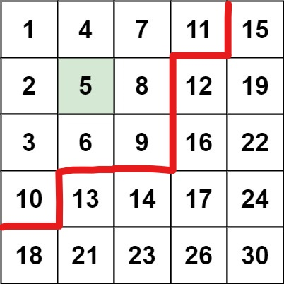

# 双指针

[toc]

## 比较经典的(做的比较多的)

### 二分法

[README](二分算法/readme.md)

### 滑动窗口法

[README](滑动窗口/readme.md)

## 两侧逼近(矩阵搜索/..)

- 模板题[633平方数之和](633.平方数之和.c)

    ```c
    bool judgeSquareSum(int c) {
        long left = 0;
        long right = (int)sqrt(c);
        while (left <= right) {
            long sum = left * left + right * right;
            if (sum == c) {
                return true;
            } else if (sum > c) {
                right--;
            } else {
                left++;
            }
        }
        return false;
    }
    ```

- 原型题: [矩阵搜索](https://leetcode-cn.com/problems/search-a-2d-matrix-ii/)

    ```c
    bool searchMatrix(int** matrix, int matrixSize, int* matrixColSize, int target){
        int i = 0;
        int j = matrixColSize[0]-1;
        while(i<matrixSize && j>=0 && matrix[i][j] != target){
            if(matrix[i][j] > target){
                j--;
            }else{
                i++;
            }
        }
        return i<matrixSize && j>=0;
    }
    ```

- **特征:** 有一个**二元函数映射** $c=f(a,b)$ ，只要 $f(a,b)$ 满足**随 $a,b$ 递增**，且要**搜索**的是一个**有序序列**，就可以使用这种双指针法
- 对应这个矩阵, `a`, `b` 为单元格坐标, `f(a,b)` 为单元格的值, 问题为矩阵中是否存在 `c` 

    

- 按照这种解法, 起点一定在右上角, 而 `target` 一定存在于下图的这条红线上(`target=11.5`), 这种方法就是沿着这条线找, 直到超出边界:

    

- 因此复杂度为 $O(max(m,n))$
